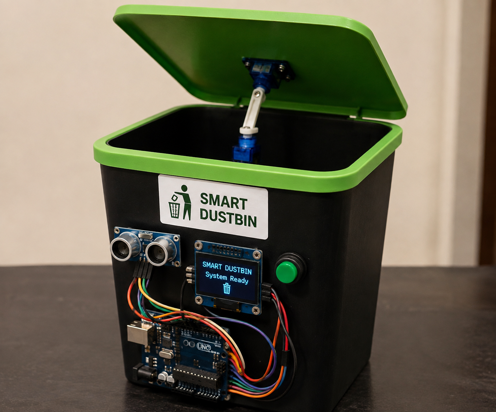
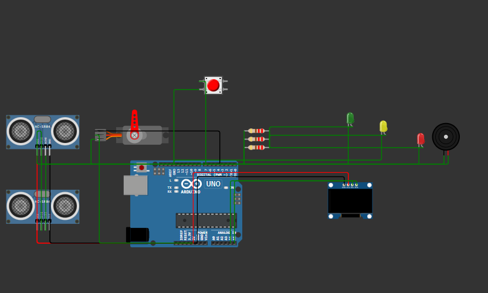
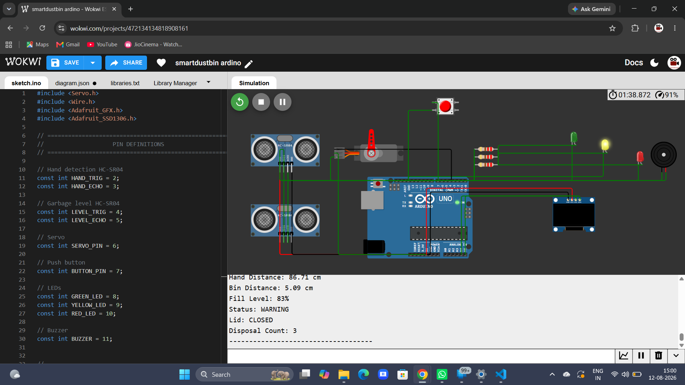

# Smart-Dustbin-Embedded-System
# 🗑️ Smart Dustbin – Automatic Waste Management System

An **Arduino-based Smart Dustbin** that automatically opens and closes its lid when a person approaches. The project uses an **ultrasonic sensor** to detect objects, a **servo motor** to control the lid, and an **OLED display** to show the system status.

## 📌 Project Overview

The Smart Dustbin is designed to provide a **contactless and hygienic waste-disposal experience**. When a person brings their hand or waste near the dustbin, the ultrasonic sensor detects the object and the servo motor automatically opens the lid.

After a short delay, the lid automatically closes. A push button can also be used for manual control, while the OLED display provides real-time information about the dustbin's status.

## ✨ Features

* 🚮 Automatic lid opening and closing
* 📡 Ultrasonic-based object detection
* ⚙️ Servo motor controlled lid
* 🖥️ OLED display for system status
* 🔘 Push-button manual control
* 🧼 Contactless operation
* ⚡ Arduino-based control system
* 🔄 Automatic closing after a specified delay
* 💡 Low-cost and easy-to-build prototype

## 🛠️ Hardware Requirements

| Component                       | Purpose                          |
| ------------------------------- | -------------------------------- |
| Arduino Uno                     | Main microcontroller             |
| HC-SR04 Ultrasonic Sensor       | Detects nearby objects           |
| Servo Motor                     | Opens and closes the lid         |
| 0.96" OLED Display (128×64 I2C) | Displays system status           |
| Push Button                     | Manual lid control               |
| Resistor                        | Push-button circuit              |
| Jumper Wires                    | Connections                      |
| Breadboard                      | Prototyping                      |
| Dustbin with Lid                | Physical project structure       |
| External Power Supply           | Power for components if required |

## 💻 Software Requirements

* Arduino IDE
* Arduino C/C++
* Adafruit SSD1306 Library
* Adafruit GFX Library
* Servo Library

## 🔌 Working Principle

The system works in the following sequence:

1. The **ultrasonic sensor** continuously measures the distance between the sensor and an approaching object.
2. If an object comes within the predefined detection range, the Arduino identifies it.
3. The **servo motor rotates** and opens the dustbin lid.
4. The OLED display shows a message such as **"Lid Open"**.
5. After the object moves away and the specified delay expires, the servo rotates back.
6. The lid closes automatically.
7. The OLED display changes to **"Lid Closed"**.
8. The **push button** can be used to manually operate the lid when required.

## 🔄 System Flow

```text
        START
          │
          ▼
   Initialize Arduino
          │
          ▼
 Initialize Ultrasonic,
 OLED & Servo
          │
          ▼
  Measure Distance
          │
          ▼
   Object Detected?
      ┌───┴───┐
     YES      NO
      │        │
      ▼        │
 Open Lid      │
      │        │
      ▼        │
OLED: OPEN     │
      │        │
      ▼        │
 Wait / Delay  │
      │        │
      ▼        │
 Close Lid ◄───┘
      │
      ▼
OLED: CLOSED
      │
      ▼
 Repeat
```

## 📐 Circuit Connections

### HC-SR04 Ultrasonic Sensor

| HC-SR04 | Arduino     |
| ------- | ----------- |
| VCC     | 5V          |
| GND     | GND         |
| TRIG    | Digital Pin |
| ECHO    | Digital Pin |

### Servo Motor

| Servo Wire | Connection                      |
| ---------- | ------------------------------- |
| VCC        | 5V / External 5V                |
| GND        | GND                             |
| Signal     | Arduino PWM-capable digital pin |

> **Note:** If the servo draws significant current, use an external 5V supply and connect its GND to Arduino GND.

### OLED Display

| OLED | Arduino Uno |
| ---- | ----------- |
| VCC  | 5V*         |
| GND  | GND         |
| SDA  | A4          |
| SCL  | A5          |

*Use the voltage specified by your particular OLED module.

### Push Button

The push button is connected to a digital input pin and configured using an appropriate pull-up/pull-down arrangement.

## 📂 Project Structure

```text
Smart-Dustbin/
│
├── Smart_Dustbin.ino
├── README.md
│
└── images/
    ├── circuit.jpg
    ├── prototype.jpg
    └── working.jpg
```

## 🚀 Installation & Setup

### 1. Install Arduino IDE

Download and install the Arduino IDE.

### 2. Install Required Libraries

From Arduino IDE:

```text
Sketch
 → Include Library
 → Manage Libraries
```

Install:

```text
Adafruit GFX Library
Adafruit SSD1306
```

The Servo library is generally included with the Arduino IDE.

### 3. Connect the Components

Connect the ultrasonic sensor, servo motor, OLED display and push button according to the circuit configuration.

### 4. Upload the Code

Open:

```text
Smart_Dustbin.ino
```

Select:

```text
Tools → Board → Arduino Uno
```

Select the correct COM port and upload the program.

### 5. Test the System

Bring your hand or an object near the ultrasonic sensor.

The system should:

```text
Object Detected
       ↓
   Lid Opens
       ↓
 OLED: Lid Open
       ↓
     Delay
       ↓
   Lid Closes
       ↓
 OLED: Lid Closed
```

## 🎯 Applications

The Smart Dustbin can be used in:

* 🏠 Homes
* 🏫 Schools and colleges
* 🏢 Offices
* 🏥 Hospitals
* 🏨 Hotels
* 🛍️ Shopping malls
* 🚉 Public places
* 🏭 Industrial environments

## 🌱 Advantages

* Reduces direct contact with the dustbin
* Improves hygiene
* Provides convenient waste disposal
* Simple and affordable design
* Easy to modify and upgrade
* Suitable for IoT and embedded-system learning
* Can reduce unnecessary touching of waste-bin surfaces

## 🔮 Future Enhancements

The project can be upgraded with additional smart features:

* 📱 Mobile application control
* ☁️ IoT-based monitoring
* 📊 Waste-level monitoring
* 🔔 Full-bin notification
* 📷 Camera-based waste classification
* ♻️ Automatic wet/dry waste segregation
* 🌐 Cloud-based data monitoring
* 🔋 Battery/solar-powered operation
* 📍 Multiple dustbin monitoring through a central dashboard
* 🤖 AI-based waste classification

## 🧪 Expected Output

When the system is powered on:

```text
SMART DUSTBIN
System Ready
```

When an object is detected:

```text
Object Detected
Lid Opening...
```

After opening:

```text
LID OPEN
Please Dispose Waste
```

After the delay:

```text
Lid Closing...
```

Finally:

```text
LID CLOSED
System Ready
```

## 📸 Project Demonstration

Add your project images inside the `images` folder and update this section:

```markdown
## Project Images






```

## 👨‍💻 Technologies Used

* **Arduino**
* **Embedded C/C++**
* **Ultrasonic Sensing**
* **Servo Motor Control**
* **I2C Communication**
* **OLED Display**
* **Embedded Systems**

## 📜 License

This project is created for **educational and academic purposes**. You are free to modify and improve the project for learning and development.

## ⭐ Acknowledgement

This project was developed as an **embedded-system prototype for smart waste management**, demonstrating the practical use of sensors, actuators, microcontrollers and display modules.

---

### ⭐ If you find this project useful, consider giving the repository a star!

